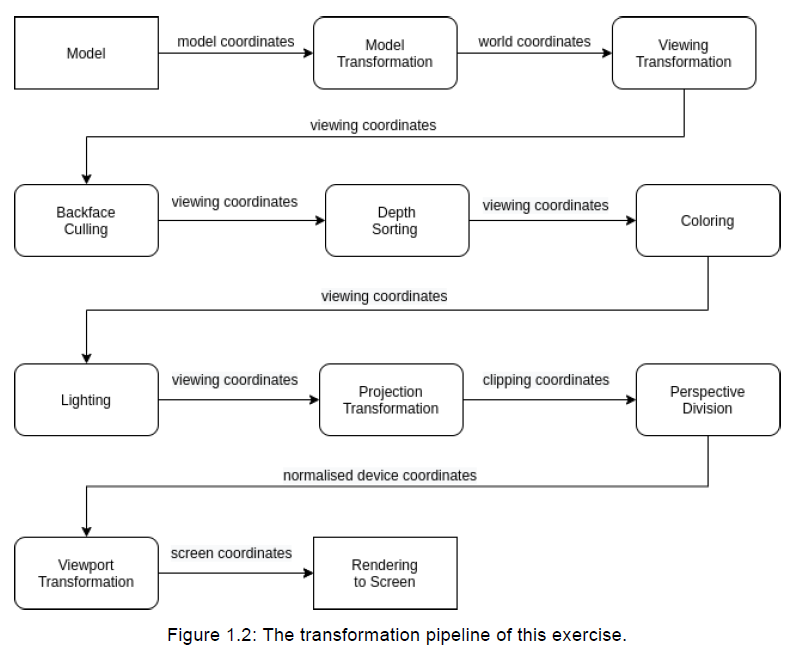

# Utah Teapot

We have to implement a ***Push pipeline*** and a ***Pull pipeline***, therefore we choose one of them to begin with. 
We started with the Push pipeline.
In a Push pipeline, each pipe and filter has to ``push()`` the data to the next filter (``successor``).
Therefore, we decided to initialize all filters first and ``setSuccessor()`` one by one afterward.

In the pull pipeline, each filter has to ``pull()`` the data from the previous filter (``source``).
Therefore, we decided to initialize all filters with their source.

The pipeline should have the following workflow:
